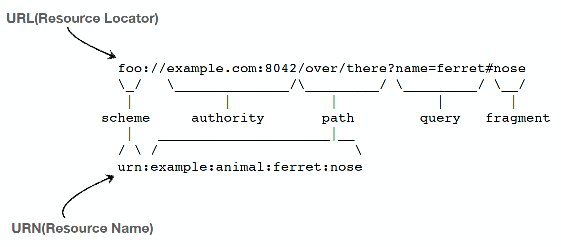

# 인프런 - HTTP 강의 - 김영한님

## 인터넷 네트워크

## URI와 웹 브라우저 요청 흐름

## HTTP 기본

## HTTP 메서드 

## HTTP 메서드 활용

## HTTP 상태 코드

## HTTP 헤더 1 - 일반 헤더

## HTTP 헤더 2 - 캐시와 조건부 요청 

# 인터넷 네트워크

* IP(Internet Protocol)
* TCP, UDP
* PORT
* DNS

## IP

* 인터넷 프로토콜 역할
  * 지정한 IP 주소(IP Address)에 데이터 전달
  * 패킷(Packet)이라는 통신 단위로 데이터 전달

* 패킷
  * 출발지 IP
  * 목적지 IP
  * 전송 데이터(메시지 등)
  * 기타 등등..

* 패킷 교환방시의 장점은,

1. 네트워크 리소스 점유 시간이 적습니다. (나머지 컴퓨터들이 기다리게 되는 문제를 해결)

2. 클라이언트에서 서버로 이동하는 경로가 고정되어 있지 않습니다. (패킷마다 어떤 경로를 통해 전달될지가 결정되어 있지 않습니다. 그래서 경로상에 장애가 발생한다 하더라도 다른 경로를 통해 전송하게 되므로 안정성이 높습니다)

3. 그리고 나누어진 패킷은 순서(넘버링)가 매겨지기에 중간에 유실된 패킷에 대한 재요청이 가능하여 전체 내용을 재전송하지 않아도 되는 것이 장점입니다. (강의를 계속 진행하시면 syn, ack 신호 교환을 배우게 되는데, 이는 각 패킷에 모두 적용됩니다)

* 단점으로는 
  * 모든 패킷에 대한 syn, ack 확인과정이 추가되는 것, 모든 패킷에 헤더가 붙어야 한다는 것등에 따른 오버헤드 발생이라고 할 수 있습니다.

* IP 프로토콜의 한계
  * 비연결성
    * 패킷을 받을 대상이 없거나 서비스 불능 상태여도 패킷 전송
  * 비신뢰성
    * 중간에 패킷이 사라지면?
    * 패킷이 순서대로 안오면?
  * 프로그램 구분
    * 같은 IP를 사용하는 서버에서 통신하는 애플리케이션이 둘 이상이면?
     
* `이 문제들을 해결해 주는것이 TCP 프로토콜`

# TCP , UDP

## TCP
* 인터넷 프로토콜의 4계층
  *  
  * 
  * 

* TCP/IP 패킷 정보
  * 출발지 IP, 목적지 IP..
  * 

* TCP 특징
  * 전송 제어 프로토콜(Transmission Control Protocol)
  * 연결지향 - TCP 3 way handshake (가상 연결)
  * 데이터 전달 보증
  * 순서 보장(패킷 순서)
  * 신뢰할 수 있는 프로토콜
  * 현재는 대부분 TCP 사용

## UDP
사용자 데이터그램 프로토콜(User Datagram Protocol)
* 하얀 도화지에 비유(기능이 거의 없음)
*  연결지향 - TCP 3 way handshake X
* 데이터 전달 보증 X
* 순서 보장 X
* 데이터 전달 및 순서가 보장되지 않지만, 단순하고 빠름(TCP에비해)
* 정리하자면
  * IP와 거의 같다. +PORT +체크섬 정도만 추가
  * 애플리케이션에서 추가 작업 필요

> UDP는 정해진 규칙이 없기 때문에 (TCP는 이미 국제 표준, 우리가 커스텀 못함) 애플리케이션 레벨에서 우리가 커스텀해서 사용할 수 있다는 장점이 있다.. 

# PORT

* 한 IP 내에서 한번에 둘 이상 연결하려면 IP 정보만으론 부족하다.
* 그러기 위해서 포트번호를 사용한다.  
* 

* 같은 IP 내에서 프로세스를 구분하는 방법 

## 포트번호
* 0 ~ 65535 할당 가능 포트 번호
* 0 ~ 1023 : 잘 알려진 포트, 사용하지 않는것이 좋다. 
* 나머지를 가지고 애플리케이션을 만들 때 열어서 사용한다. 
  * FTP - 20, 21
  * TELNET - 23
  * HTTP - 80
  * HTTPS - 443 
  * ...등등

# DNS
* IP 번호는 기억하기 어렵고 변경될 수 있다. 
* 문자로 이름을 지어서 기억하기 쉽게 만들 수 있따.
* DNS : Domain Name System
  * 도메인 명을 IP 주소로 변환 
  * IP가 주소가 변해도 도메인에 새로 맵핑하면 도메인으로는 항상 일정한 곳에 접근 가능  

# URI
URI(Uniform Resource Identifier)

* URI? URL? URN
   * "URI는 로케이터(locator, URL), 이름(name, URN) 또는 둘 다 추가로 분류될 수 있다"
     * 리소스의 위치, 리소스의 이름  
   * https://www.ietf.org/rfc/rfc3986.txt - 1.1.3. URI, URL, and URN < 표준 스펙 

* 
* 중요
  *  

## URI
단어 뜻
* Uniform: 리소스 식별하는 통일된 방식
* Resource: 자원, URI로 식별할 수 있는 모든 것(제한 없음)
* Identifier: 다른 항목과 구분하는데 필요한 정보
* URL: Uniform Resource Locator
* URN: Uniform Resource Name

## URL, URN
단어 뜻
* URL - Locator: 리소스가 있는 위치를 지정
* URN - Name: 리소스에 이름을 부여
* 위치는 변할 수 있지만, 이름은 변하지 않는다.
* urn:isbn:8960777331 (어떤 책의 isbn URN)
* URN 이름만으로 실제 리소스를 찾을 수 있는 방법이 보편화 되지 않음
* 앞으로 URI를 URL과 같은 의미로 이야기하겠음

## URL 분석
https://www.google.com/search?q=hello&hl=ko

* scheme://[userinfo@]host[:port][/path][?query][#fragment]
* https://www.google.com:443/search?q=hello&hl=ko
* 프로토콜(https)
* 호스트명(www.google.com)
* 포트 번호(443)
* 패스(/search)
* 쿼리 파라미터(q=hello&hl=ko)

### scheme
* `scheme`://[userinfo@]host[:port][/path][?query][#fragment]
* `https`://www.google.com:443/search?q=hello&hl=ko
* 주로 프로토콜 사용
* 프로토콜: 어떤 방식으로 자원에 접근할 것인가 하는 약속 규칙
  * 예) http, https, ftp 등등
* http는 80 포트, https는 443 포트를 주로 사용, 포트는 생략 가능
* https는 http에 보안 추가 (HTTP Secure)

### userinfo
* scheme://`[userinfo@]`host[:port][/path][?query][#fragment]
* https://www.google.com:443/search?q=hello&hl=ko
* URL에 사용자정보를 포함해서 인증
* 거의 사용하지 않음

### host
* scheme://[userinfo@]`host`[:port][/path][?query][#fragment]
* https://`www.google.com`:443/search?q=hello&hl=ko
* 호스트명
* 도메인명 또는 IP 주소를 직접 사용가능

### PORT
* scheme://[userinfo@]host`[:port]`[/path][?query][#fragment]
* https://www.google.com:`443`/search?q=hello&hl=ko
* 포트(PORT)
* 접속 포트
* 일반적으로 생략, 생략시 http는 80, https는 443

### path
* scheme://[userinfo@]host[:port]`[/path]`[?query][#fragment]
* https://www.google.com:443/`search`?q=hello&hl=ko
* 리소스 경로(path), 계층적 구조
* 예)
  * /home/file1.jpg
  * /members
  * /members/100, /items/iphone12

### query
* scheme://[userinfo@]host[:port][/path]`[?query]`[#fragment]
* https://www.google.com:443/search`?q=hello&hl=ko`
* key=value 형태
* ?로 시작, &로 추가 가능 ?keyA=valueA&keyB=valueB
* query parameter, query string 등으로 불림, 웹서버에 제공하는 파라미터, 문자 형태

### fragment
* scheme://[userinfo@]host[:port][/path][?query][#fragment]
* https://docs.spring.io/spring-boot/docs/current/reference/html/gettingstarted.html#getting-started-introducing-spring-boot
* fragment
* `html 내부 북마크 등에 사용, 서버에 전송하는 정보 아님` 

# 웹 브라우저 요청 흐름 

* 

* HTTP 요청 메시지 : 
  * GET /search?q=hello&hl=ko HTTP/1.1  
    Host: www.google.com

* HTTP 메시지 전송 
  *  

* HTTP 응답 메시지
  * 