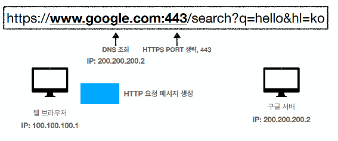

# 인프런 - HTTP 강의 - 김영한님

## 인터넷 네트워크

## URI와 웹 브라우저 요청 흐름

## HTTP 기본

## HTTP 메서드 

## HTTP 메서드 활용

## HTTP 상태 코드

## HTTP 헤더 1 - 일반 헤더

## HTTP 헤더 2 - 캐시와 조건부 요청 

# 인터넷 네트워크

* IP(Internet Protocol)
* TCP, UDP
* PORT
* DNS

## IP

* 인터넷 프로토콜 역할
  * 지정한 IP 주소(IP Address)에 데이터 전달
  * 패킷(Packet)이라는 통신 단위로 데이터 전달

* 패킷
  * 출발지 IP
  * 목적지 IP
  * 전송 데이터(메시지 등)
  * 기타 등등..

* 패킷 교환방시의 장점은,

1. 네트워크 리소스 점유 시간이 적습니다. (나머지 컴퓨터들이 기다리게 되는 문제를 해결)

2. 클라이언트에서 서버로 이동하는 경로가 고정되어 있지 않습니다. (패킷마다 어떤 경로를 통해 전달될지가 결정되어 있지 않습니다. 그래서 경로상에 장애가 발생한다 하더라도 다른 경로를 통해 전송하게 되므로 안정성이 높습니다)

3. 그리고 나누어진 패킷은 순서(넘버링)가 매겨지기에 중간에 유실된 패킷에 대한 재요청이 가능하여 전체 내용을 재전송하지 않아도 되는 것이 장점입니다. (강의를 계속 진행하시면 syn, ack 신호 교환을 배우게 되는데, 이는 각 패킷에 모두 적용됩니다)

* 단점으로는 
  * 모든 패킷에 대한 syn, ack 확인과정이 추가되는 것, 모든 패킷에 헤더가 붙어야 한다는 것등에 따른 오버헤드 발생이라고 할 수 있습니다.

* IP 프로토콜의 한계
  * 비연결성
    * 패킷을 받을 대상이 없거나 서비스 불능 상태여도 패킷 전송
  * 비신뢰성
    * 중간에 패킷이 사라지면?
    * 패킷이 순서대로 안오면?
  * 프로그램 구분
    * 같은 IP를 사용하는 서버에서 통신하는 애플리케이션이 둘 이상이면?
     
* `이 문제들을 해결해 주는것이 TCP 프로토콜`

# TCP , UDP

## TCP
* 인터넷 프로토콜의 4계층
  *  
  * 
  * 

* TCP/IP 패킷 정보
  * 출발지 IP, 목적지 IP..
  * 

* TCP 특징
  * 전송 제어 프로토콜(Transmission Control Protocol)
  * 연결지향 - TCP 3 way handshake (가상 연결)
  * 데이터 전달 보증
  * 순서 보장(패킷 순서)
  * 신뢰할 수 있는 프로토콜
  * 현재는 대부분 TCP 사용

## UDP
사용자 데이터그램 프로토콜(User Datagram Protocol)
* 하얀 도화지에 비유(기능이 거의 없음)
*  연결지향 - TCP 3 way handshake X
* 데이터 전달 보증 X
* 순서 보장 X
* 데이터 전달 및 순서가 보장되지 않지만, 단순하고 빠름(TCP에비해)
* 정리하자면
  * IP와 거의 같다. +PORT +체크섬 정도만 추가
  * 애플리케이션에서 추가 작업 필요

> UDP는 정해진 규칙이 없기 때문에 (TCP는 이미 국제 표준, 우리가 커스텀 못함) 애플리케이션 레벨에서 우리가 커스텀해서 사용할 수 있다는 장점이 있다.. 

# PORT

* 한 IP 내에서 한번에 둘 이상 연결하려면 IP 정보만으론 부족하다.
* 그러기 위해서 포트번호를 사용한다.  
* 

* 같은 IP 내에서 프로세스를 구분하는 방법 

## 포트번호
* 0 ~ 65535 할당 가능 포트 번호
* 0 ~ 1023 : 잘 알려진 포트, 사용하지 않는것이 좋다. 
* 나머지를 가지고 애플리케이션을 만들 때 열어서 사용한다. 
  * FTP - 20, 21
  * TELNET - 23
  * HTTP - 80
  * HTTPS - 443 
  * ...등등

# DNS
* IP 번호는 기억하기 어렵고 변경될 수 있다. 
* 문자로 이름을 지어서 기억하기 쉽게 만들 수 있따.
* DNS : Domain Name System
  * 도메인 명을 IP 주소로 변환 
  * IP가 주소가 변해도 도메인에 새로 맵핑하면 도메인으로는 항상 일정한 곳에 접근 가능  

# URI
URI(Uniform Resource Identifier)

* URI? URL? URN
   * "URI는 로케이터(locator, URL), 이름(name, URN) 또는 둘 다 추가로 분류될 수 있다"
     * 리소스의 위치, 리소스의 이름  
   * https://www.ietf.org/rfc/rfc3986.txt - 1.1.3. URI, URL, and URN < 표준 스펙 

* 
* 중요
  *  

## URI
단어 뜻
* Uniform: 리소스 식별하는 통일된 방식
* Resource: 자원, URI로 식별할 수 있는 모든 것(제한 없음)
* Identifier: 다른 항목과 구분하는데 필요한 정보
* URL: Uniform Resource Locator
* URN: Uniform Resource Name

## URL, URN
단어 뜻
* URL - Locator: 리소스가 있는 위치를 지정
* URN - Name: 리소스에 이름을 부여
* 위치는 변할 수 있지만, 이름은 변하지 않는다.
* urn:isbn:8960777331 (어떤 책의 isbn URN)
* URN 이름만으로 실제 리소스를 찾을 수 있는 방법이 보편화 되지 않음
* 앞으로 URI를 URL과 같은 의미로 이야기하겠음

## URL 분석
https://www.google.com/search?q=hello&hl=ko

* scheme://[userinfo@]host[:port][/path][?query][#fragment]
* https://www.google.com:443/search?q=hello&hl=ko
* 프로토콜(https)
* 호스트명(www.google.com)
* 포트 번호(443)
* 패스(/search)
* 쿼리 파라미터(q=hello&hl=ko)

### scheme
* `scheme`://[userinfo@]host[:port][/path][?query][#fragment]
* `https`://www.google.com:443/search?q=hello&hl=ko
* 주로 프로토콜 사용
* 프로토콜: 어떤 방식으로 자원에 접근할 것인가 하는 약속 규칙
  * 예) http, https, ftp 등등
* http는 80 포트, https는 443 포트를 주로 사용, 포트는 생략 가능
* https는 http에 보안 추가 (HTTP Secure)

### userinfo
* scheme://`[userinfo@]`host[:port][/path][?query][#fragment]
* https://www.google.com:443/search?q=hello&hl=ko
* URL에 사용자정보를 포함해서 인증
* 거의 사용하지 않음

### host
* scheme://[userinfo@]`host`[:port][/path][?query][#fragment]
* https://`www.google.com`:443/search?q=hello&hl=ko
* 호스트명
* 도메인명 또는 IP 주소를 직접 사용가능

### PORT
* scheme://[userinfo@]host`[:port]`[/path][?query][#fragment]
* https://www.google.com:`443`/search?q=hello&hl=ko
* 포트(PORT)
* 접속 포트
* 일반적으로 생략, 생략시 http는 80, https는 443

### path
* scheme://[userinfo@]host[:port]`[/path]`[?query][#fragment]
* https://www.google.com:443/`search`?q=hello&hl=ko
* 리소스 경로(path), 계층적 구조
* 예)
  * /home/file1.jpg
  * /members
  * /members/100, /items/iphone12

### query
* scheme://[userinfo@]host[:port][/path]`[?query]`[#fragment]
* https://www.google.com:443/search`?q=hello&hl=ko`
* key=value 형태
* ?로 시작, &로 추가 가능 ?keyA=valueA&keyB=valueB
* query parameter, query string 등으로 불림, 웹서버에 제공하는 파라미터, 문자 형태

### fragment
* scheme://[userinfo@]host[:port][/path][?query][#fragment]
* https://docs.spring.io/spring-boot/docs/current/reference/html/gettingstarted.html#getting-started-introducing-spring-boot
* fragment
* `html 내부 북마크 등에 사용, 서버에 전송하는 정보 아님` 

# 웹 브라우저 요청 흐름 

* 

* HTTP 요청 메시지 : 
  * GET /search?q=hello&hl=ko HTTP/1.1  
    Host: www.google.com

* HTTP 메시지 전송 
  *  

* HTTP 응답 메시지
  * 

# HTTP
HyperText Transfer Protocol

* 모든 것이 HTTP
* 클라이언트 서버 구조
* Stateful, Stateless
* 비 연결성(connectionless)
* HTTP 메시지

## 모든 것이 HTTP
HTTP 메시지에 모든 것을 전송
* HTML, TEXT
* IMAGE, 음성, 영상, 파일
* JSON, XML (API)
* 거의 모든 형태의 데이터 전송 가능
* 서버간에 데이터를 주고 받을 때도 대부분 HTTP 사용
* 지금은 HTTP 시대!

### 기반 프로토콜
* TCP: HTTP/1.1, HTTP/2
* UDP: HTTP/3
* 현재 HTTP/1.1 주로 사용
* HTTP/2, HTTP/3 도 점점 증가

## 클라이언트 서버 구조
* Request Response 구조
* 클라이언트는 서버에 요청을 보내고, 응답을 대기
* 서버가 요청에 대한 결과를 만들어서 응답

## 무상태 프로토콜
스테이스리스(Stateless)
* 서버가 클라이언트의 상태를 보존X
* 장점: 서버 확장성 높음(스케일 아웃)
* 단점: 클라이언트가 추가 데이터 전송

## Stateless
실무 한계
* 모든 것을 무상태로 설계 할 수 있는 경우도 있고 없는 경우도 있다.
* 무상태
* 예) 로그인이 필요 없는 단순한 서비스 소개 화면
* 상태 유지
* 예) 로그인
* 로그인한 사용자의 경우 로그인 했다는 상태를 서버에 유지
* `일반적으로 브라우저 쿠키와 서버 세션등을 사용해서 상태 유지`
* 상태 유지는 최소한만 사용

# 비 연결성(connectionless)

* HTTP는 기본이 연결을 유지하지 않는 모델
* 일반적으로 초 단위의 이하의 빠른 속도로 응답
* 1시간 동안 수천명이 서비스를 사용해도 실제 서버에서 동시에 처리하는 요청은 수십개 이
하로 매우 작음
* 예) 웹 브라우저에서 계속 연속해서 검색 버튼을 누르지는 않는다.
* 서버 자원을 매우 효율적으로 사용할 수 있음

## 한계와 극복
* TCP/IP 연결을 새로 맺어야 함 - 3 way handshake 시간 추가
* 웹 브라우저로 사이트를 요청하면 HTML 뿐만 아니라 자바스크립트, css, 추가 이미지 등
등 수 많은 자원이 함께 다운로드
* 지금은 HTTP 지속 연결(Persistent Connections)로 문제 해결
* HTTP/2, HTTP/3에서 더 많은 최적화

## 스테이스리스를 기억하자
서버 개발자들이 어려워하는 업무
* 정말 같은 시간에 딱 맞추어 발생하는 대용량 트래픽
* 예) 선착순 이벤트, 명절 KTX 예약, 학과 수업 등록
* 예) 저녁 6:00 선착순 1000명 치킨 할인 이벤트 -> 수만명 동시 요청

# HTTP 메시지

HTTP 메시지에 모든 것을 전송
* HTML, TEXT
* IMAGE, 음성, 영상, 파일
* JSON, XML
* 거의 모든 형태의 데이터 전송 가능
* 서버간에 데이터를 주고 받을 때도 대부분 HTTP 사용
* 지금은 HTTP 시대!

* 

## 시작 라인
GET /search?q=hello&hl=ko HTTP/1.1  
Host: www.google.com

start-line = request-line / status-line
* request-line = method SP(공백) request-target SP HTTP-version CRLF(엔터)
* HTTP 메서드 (GET: 조회)
* 요청 대상 (/search?q=hello&hl=ko)
* HTTP Version

## 요청 메시지 - HTTP 메서드
`GET` /search?q=hello&hl=ko HTTP/1.1  
Host: www.google.com
* 종류: GET, POST, PUT, DELETE...
* 서버가 수행해야 할 동작 지정
* GET: 리소스 조회
* POST: 요청 내역 처리

## 요청 메시지 - 요청 대상

GET `/search?q=hello&hl=ko` HTTP/1.1  
Host: www.google.com
* absolute-path[?query] (절대경로[?쿼리])
* 절대경로= "/" 로 시작하는 경로
* 참고: *, http://...?x=y 와 같이 다른 유형의 경로지정 방법도 있다

## 요청 메시지 - HTTP 버전
GET /search?q=hello&hl=ko `HTTP/1.1 ` 
Host: www.google.com
* HTTP Version

## 응답 메시지
`HTTP/1.1 200 OK `  
Content-Type: text/html;charset=UTF-8  
Content-Length: 3423  
<html>  
<body>...</body>  
</html>  

HTTP 버전
* HTTP 상태 코드: 요청 성공, 실패를 나타냄
* 200: 성공
* 400: 클라이언트 요청 오류
* 500: 서버 내부 오류
* 이유 문구: 사람이 이해할 수 있는 짧은 상태 코드 설명 글

## 응답메시지 - HTTP 헤더
>HTTP/1.1 200 OK   
>`Content-Type: text/html;charset=UTF-8`     
`Content-Length: 3423  `  

용도
* HTTP 전송에 필요한 모든 부가정보
* 예) 메시지 바디의 내용, 메시지 바디의 크기, 압축, 인증, 요청 클라이언트(브라우저) 정보, 서버 애플리케이션 정보, 캐시 관리 정보...
* 표준 헤더가 너무 많음
* https://en.wikipedia.org/wiki/List_of_HTTP_header_fields
* 필요시 임의의 헤더 추가 가능
* helloworld: hihi

## 응답메시지 - HTTP 메시지 바디
>HTTP/1.1 200 OK    
Content-Type: text/html;charset=UTF-8  
Content-Length: 3423  
>`<html>`  
`<body>...</body>`  
`</html>`  

용도
* 실제 전송할 데이터
*  HTML 문서, 이미지, 영상, JSON 등등 byte로 표현할 수 있는 모든 데이터 전송 가능

# HTTP 메서드
* HTTP 메서드 - GET, POST 
* HTTP 메서드 - PUT, PATCH, DELETE
* HTTP 메서드의 속성

## 요구사항
회원 정보 관리 API를 만들어라.
* 회원 목록 조회
* 회원 조회
* 회원 등록
* 회원 수정
* 회원 삭제

## API URI 고민
URI(Uniform Resource Identifier)
* 리소스의 의미는 뭘까?
* 회원을 등록하고 수정하고 조회하는게 리소스가 아니다!
* 예) 미네랄을 캐라 -> 미네랄이 리소스
* 회원이라는 개념 자체가 바로 리소스다.
* 리소스를 어떻게 식별하는게 좋을까?
* 회원을 등록하고 수정하고 조회하는 것을 모두 배제
* 회원이라는 리소스만 식별하면 된다. -> 회원 리소스를 URI에 매핑

## API URI 설계
리소스 식별, URI 계층 구조 활용
* 회원 목록 조회 /members
* 회원 조회 /members/{id} -> 어떻게 구분하지?
* 회원 등록 /members/{id} -> 어떻게 구분하지?
* 회원 수정 /members/{id} -> 어떻게 구분하지?
* 회원 삭제 /members/{id} -> 어떻게 구분하지?

## API URI 설계 - 리소스와 행위을 분리
가장 중요한 것은 리소스를 식별하는 것
* URI는 리소스만 식별!
* 리소스와 해당 리소스를 대상으로 하는 행위을 분리
* 리소스: 회원
* 행위: 조회, 등록, 삭제, 변경
* 리소스는 명사, 행위는 동사 (미네랄을 캐라)
* 행위(메서드)는 어떻게 구분?

# HTTP 메서드 - GET, POST

## HTTP 메서드 종류
주요 메서드
* GET: 리소스 조회
* POST: 요청 데이터 처리, 주로 등록에 사용
* PUT: 리소스를 대체, 해당 리소스가 없으면 생성. 덮어쓰기 
* PATCH: 리소스 부분 변경
* DELETE: 리소스 삭제

기타 메서드
* HEAD: GET과 동일하지만 메시지 부분을 제외하고, 상태 줄과 헤더만 반환
* OPTIONS: 대상 리소스에 대한 통신 가능 옵션(메서드)을 설명(주로 CORS에서 사용)
* CONNECT: 대상 자원으로 식별되는 서버에 대한 터널을 설정
* TRACE: 대상 리소스에 대한 경로를 따라 메시지 루프백 테스트를 수행

## GET

* 리소스 조회
* 서버에 전달하고 싶은 데이터는 query(쿼리 파라미터, 쿼리 스트링)를 통해서 전달
* 메시지 바디를 사용해서 데이터를 전달할 수 있지만, 지원하지 않는 곳이 많아서 권장하지
않음

## POST
* 요청 데이터 처리
* 메시지 바디를 통해 서버로 요청 데이터 전달
* 서버는 요청 데이터를 처리
  * 메시지 바디를 통해 들어온 데이터를 처리하는 모든 기능을 수행한다.
* 주로 전달된 데이터로 신규 리소스 등록, 프로세스 처리에 사용

# ` POST 예시. 요청 데이터를 어떻게 처리한다는 뜻일까? 예시`
* `스펙: POST 메서드는 대상 리소스가 리소스의 고유 한 의미 체계에 따라 요청에 포함 된 표현을 처리하도록 요청합니다. (구글 번역)`

* 예를 들어 POST는 다음과 같은 기능에 사용됩니다.
  * HTML 양식에 입력 된 필드와 같은 데이터 블록을 데이터 처리 프로세스에 제공
    * 예) HTML FORM에 입력한 정보로 회원 가입, 주문 등에서 사용
  * 게시판, 뉴스 그룹, 메일링 리스트, 블로그 또는 유사한 기사 그룹에 메시지 게시
    * 예) 게시판 글쓰기, 댓글 달기
  * 서버가 아직 식별하지 않은 새 리소스 생성
    * 예) 신규 주문 생성
  * 기존 자원에 데이터 추가
    * 예) 한 문서 끝에 내용 추가하기
* `정리: 이 리소스 URI에 POST 요청이 오면 요청 데이터를 어떻게 처리할지 리소스마다 따로 정해야 함 -> 정해진 것이 없음`

## POST 정리! 
1. 새 리소스 생성(등록)
  * 서버가 아직 식별하지 않은 새 리소스 생성
2. 요청 데이터 처리
  * 단순히 데이터를 생성하거나, 변경하는 것을 넘어서 프로세스를 처리해야 하는 경우
    * 예) 주문에서 결제완료 -> 배달시작 -> 배달완료 처럼 단순히 값 변경을 넘어 프로세스의 상태가 변경되는 경우
  * `POST의 결과로 새로운 리소스가 생성되지 않을 수도 있음`
    * 예) POST /orders/{orderId}/start-delivery (컨트롤 URI)
3. 다른 메서드로 처리하기 애매한 경우
  * 예) JSON으로 조회 데이터를 넘겨야 하는데, GET 메서드를 사용하기 어려운 경우
  * 애매하면 POST

# HTTP 메서드 - PUT, PATCH, DELETE
### PUT
* 리소스를 대체
  * 리소스가 있으면 대체 (있는거 없애고 새로 생성)
  * 리소스가 없으면 생성
  * `쉽게 이야기해서 덮어버림`
* 중요! 클라이언트가 리소스를 식별  
  * 클라이언트가 리소스 위치를 알고 URI 지정
  * POST와 차이점

### PATCH
* 리소스 부분만 변경
  * 기존 데이터는 남겨두고, 변경 요청한 데이터만 변경 

### DELETE
* 리소스 제거 

